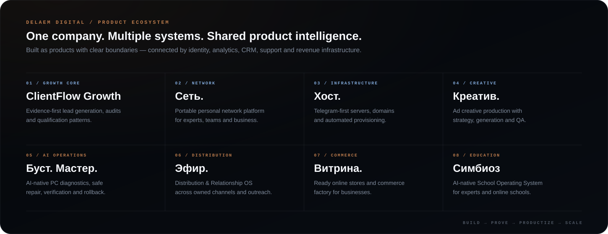

 

**[DELAEMDIGITAL.COM](https://delaemdigital.com)** &nbsp;·&nbsp; **[TELEGRAM](https://t.me/vitalycreator)** &nbsp;·&nbsp; **[DD CHANNEL](https://t.me/delaemdigital)** &nbsp;·&nbsp; **[GITHUB ORG](https://github.com/delaemdigital)**

## Founder building systems, not fragments.

I'm **Vitaly Timoshenko**, Founder & CEO of **[Delaem Digital](https://github.com/delaemdigital)** and architect of **ClientFlow System**.

I build AI-native digital systems that connect acquisition, websites, lead generation, CRM, automation, analytics and product infrastructure into one operating loop — so business can see where clients come from, how they move through the system and what to improve next.

My role inside DD: **strategy, ClientFlow architecture, product direction, internal product development, evidence and final quality.**

 

## Delaem Digital

**Delaem Digital is an AI-native product & growth company.** We don't treat websites, traffic, CRM, bots and AI as isolated services. We design the complete route from attention to client — then measure and improve it.

The company builds new systems on itself first, proves them in real operations, then turns the strongest ones into repeatable products.

 

## What I optimize for

| | |
|---|---|
| **Systems over fragments** | Architecture first. Tools second. Every part must belong to one customer and revenue flow. |
| **Evidence over promises** | Production behavior, analytics, QA and real outcomes matter more than presentation. |
| **AI as infrastructure** | AI should improve qualification, operations, production and decision-making — not exist as decoration. |
| **Build → prove → productize** | New DD products are tested internally before they become client-facing systems. |

## Current focus

- **ClientFlow Growth** — evidence-first lead generation, audits and qualification.
- **DD shared core** — reusable identity, CRM, analytics, support, billing and product infrastructure.
- **Distribution & Relationship OS** — a unified intelligence layer across owned media, outreach and social channels.
- **AI-native products** — systems for operations, infrastructure, creative production, commerce and education.

<b>Production stack behind the systems</b>

 

**Product & Growth**  
ClientFlow System · CRM · funnels · lead qualification · revenue analytics · experimentation

**Engineering**  
Next.js · TypeScript · React · Supabase · PostgreSQL · Redis · Docker

**AI**  
OpenAI · Anthropic · Gemini · OpenRouter · RAG · pgvector · structured outputs · evals

**Automation & Operations**  
Telegram Bot API · n8n · GitHub · PostHog · Better Stack · Langfuse · Playwright

## Public engineering

Most production repositories are private, but the public engineering surface lives inside **[@delaemdigital](https://github.com/delaemdigital)**.

- **[Symbioz Cursor Factory](https://github.com/delaemdigital/Symbioz-Cursor-Factory)** — public AI-assisted development and visual/product tooling from the Symbioz engineering system.
- **[Delaem Digital Organization](https://github.com/delaemdigital)** — company repositories, product engineering and organization profile.

## Contact

**Website:** [delaemdigital.com](https://delaemdigital.com)  
**Telegram:** [@vitalycreator](https://t.me/vitalycreator)  
**Delaem Digital:** [@delaemdigital](https://github.com/delaemdigital)

---

**SYSTEMS → CLIENTS → GROWTH**

