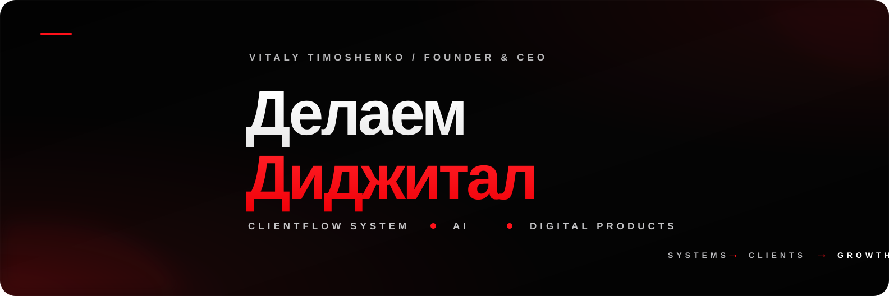
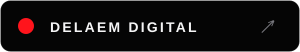
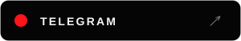
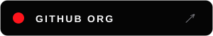
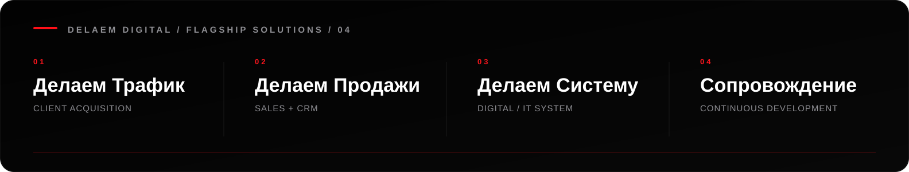

 

## Founder & CEO at Delaem Digital. Architect of ClientFlow System.

For **8 years** I have worked across acquisition, websites, CRM, product, automation and AI. The same problem kept showing up: businesses rarely lose money because they are missing one more tool. They lose it in the gaps **between** the tools.

That is why I built **Delaem Digital** around one idea: the customer journey should operate as **one measurable commercial system**.

**ATTENTION → TRUST → LEAD → CRM → SALE → DATA → IMPROVEMENT**

We call that architecture **ClientFlow System**.

---

## Four flagship engagements

**01 — Client Acquisition**  
Positioning, landing routes, paid acquisition, lead capture, creative testing and source-to-lead analytics.  
**Result:** qualified demand enters a route designed to convert and measure it.

**02 — Sales + CRM**  
CRM architecture, lead routing, pipeline logic, response standards, follow-up, automation and sales analytics.  
**Result:** every lead has an owner, a status and a next step.

**03 — Digital System**  
Website, acquisition, CRM, automation, AI where it changes the economics, integrations, data and management analytics.  
**Result:** one connected operating environment instead of a collection of disconnected contractors and tools.

**04 — Continuous Partnership**  
Monitoring, optimisation, experiments, integrations, automation, contractor coordination and the development roadmap.  
**Result:** the system keeps improving after launch instead of slowly becoming outdated.

> **The target relationship is long-term operational ownership — not a sequence of one-off deliverables.**

---

## ClientFlow System

ClientFlow starts with one question:

**How does a person move from attention to a real commercial action — and where does that path lose strength?**

We map the route, keep what already works, rebuild the weak links and measure what happens in production.

**Offer → Website → Acquisition → Lead → CRM → Processing → Sale → Analytics → Improvement**

No website for the sake of a website.  
No automation before the process is clear.  
No AI because it looks modern.  
No traffic into an unprepared system.

---

## Why the relationship continues after launch

Launch gives us a system. **Production gives us evidence.**

Real traffic, leads and sales show what should improve next: the offer, landing experience, traffic mix, lead quality, response speed, follow-up, CRM logic, automation or reporting.

That is the point of **Continuous Partnership**. Delaem Digital stays accountable for the improvement loop instead of disappearing after delivery.

**One commercial system. One accountable digital partner. One continuous improvement loop.**

---

## What I own personally

**Strategy · ClientFlow architecture · Product direction · System design · Evidence · Final quality**

I decide what should be built, how the parts connect, what must be measured and what the next rational development step is.

I work at the intersection of **growth, product and engineering** — close enough to strategy to understand the business, and close enough to production to verify that the system actually works.

---

## Principles

**Systems over fragments.** Every component belongs to one customer and revenue flow.  
**Evidence over promises.** Production behaviour matters more than presentation.  
**AI as infrastructure.** Use it where it improves qualification, operations, analysis or production.  
**Build → measure → improve.** Launch is the beginning of the learning loop.

---

## Public engineering

Most production repositories are **private by design**. Public engineering and reusable tooling live inside **[@delaemdigital](https://github.com/delaemdigital)**.

[**Symbioz Cursor Factory**](https://github.com/delaemdigital/Symbioz-Cursor-Factory) — public AI-assisted development and visual/product tooling from the Symbioz engineering system.

<b>Production stack</b>

 

**Growth & Product** — ClientFlow System · CRM · funnels · lead qualification · revenue analytics · experimentation  
**Engineering** — Next.js · TypeScript · React · Supabase · PostgreSQL · Redis · Docker  
**AI** — OpenAI · Anthropic · Gemini · OpenRouter · RAG · pgvector · structured outputs · evals  
**Automation & Operations** — Telegram Bot API · n8n · GitHub · PostHog · Better Stack · Langfuse · Playwright

---

### Build the system. Measure the flow. Improve what matters.

**delaemdigital.com · @vitalycreator · @delaemdigital**

